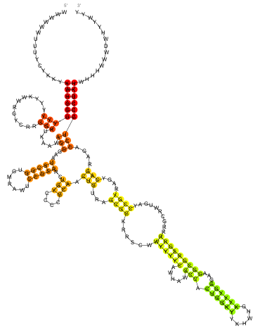
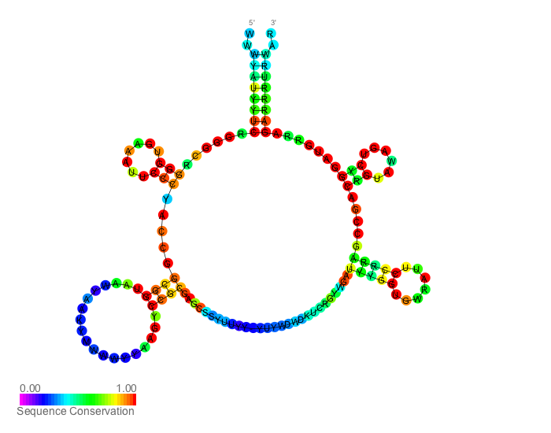
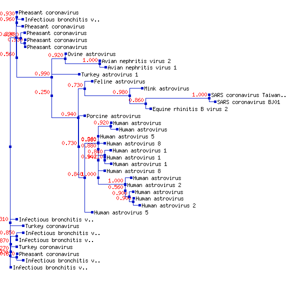

```{r setup, echo=FALSE}
knitr::opts_chunk$set(message=FALSE, fig.path='figures/')
```

<!-- Title block --> 
<br>
<p style="text-align:center;font-size:200%;color:Red"> rfaRm </p>
<p style="text-align:center;font-size:90%;color:Gray"> Lara Selles Vidal, 
Rafael Ayala, Guy-Bart Stan, Rodrigo Ledesma-Amaro </p>
<p style="text-align:center;font-size:90%;color:Gray"> April 7, 2020 </p>
<br>

# Abstract
<p style="font-size:90%"> The Rfam database is a collection of families of non-coding RNA and other structured RNA elements. Each family is defined by a multiple sequence alignment of family members, a consensus secondary structure and a covariance model, which integrates both multiple sequence alignment information and secondary structure information, and are related to the hidden Markov models employed by Pfam. "rfaRm" is an R package providing a client-side interface to the Rfam database. The package allows the search of the Rfam database by keywords or sequences, as well as the retrieval of all available information on specific Rfam families, such as member sequences, multiple sequence alignments, secondary structures and covariance models. <br><br> </p>

# Introduction

The Rfam database [@kalvari2017] is a collection of RNA sequences classified into different families of non-coding RNA, cis-regulatory elements and other structured RNA. It is designed to be analogous to the Pfam database of protein families [@elgebali2018]. The initial step for identifying an Rfam family is to generate a manually curated seed alignment of a set of known RNA sequences, ideally including secondary structure information. The Infernal software package [@nawrocki2013] is then used to build a covariance model for the family (a probabilistic profile of the sequence and secondary structure of the family), and to search for new homologs to add from a sequence database. When new homologs are added, the covariance model is updated, and the process is repeated until not new homologs are found. 

Much of the information stored in Rfam could be useful if integrated within existing genomics and transcriptomics workflows and functionalities of packages already available in BioConductor. rfaRm aims to facilitate such integration of the information provided by Rfam in existing workflows by providing an R client-side interface to the Rfam database. 

# Software features

rfaRm allows to search the Rfam database by keywords and sequence. In the search by keywords, the supplied keywodrs are matched against the fields of each entry, and accessions for the matching families are returned. In the search by sequence, the supplied sequence is used by Infernal to be searched against the Rfam library of covariance models, returning high-scoring hits which allow the identification of regions in the query sequence that belong to an Rfam family. Searches can be used to find RNA families of interest.

rfaRm also allows the retrieval of the information available in Rfam for each RNA family by providing a valid Rfam family identifier. The types of retrievable information for each Rfam family include:

* Summary description 
* Sequence regions beloning to the Rfam family
* Consensus sequence
* Consensus secondary structure
* Secondary structure plots
* Covariance model
* Seed alignment used to define the Rfam family
* Phylogenetic tree corresponding to the seed alignment
* Plots of the phylogenetic tree
* PDB entries with 3D structures of a member of the Rfam family

The results of each query are returned as R objects that can be used to perform further analysis of the retrieved data with other R packages. Additionally, when appropriate they can also be saved to standard file formats, which can be read by commonly used Bioinformatics software.

# Example

## Identify Rfam families of interest

Rfam families can be searched by keywords with the "rfamTextSearchFamilyAccession" function. The function returns a character vector where each element is a string representing the Rfam accession for an Rfam family that matched the searched keyword. Rfam accessions are always of the "RFXXXXX" structure, where X is any digit from 0 to 9. For example, in order to search for Rfam families corresponding to riboswitches, the keyword "riboswitch" can be passed as the query to the search function. The function will output a vector with the Rfam accessions of the matching families:

```{r include = FALSE}
library(rfaRm)
library(rsvg)
library(R4RNA)
library(treeio)
```

```{r tidy = TRUE}
rfamTextSearchFamilyAccession("riboswitch")
```

It is also possible to perform a sequence-based search with the "rfamSequenceSearch" function. The supplied query sequence is matched against the covariance models of the Rfam families by the Infernal software in order to identify regions in the query sequence that belong to one of the Rfam families. It should be noted that sequence-based searches can occasionally take long times to finish, sometimes up to several hours. The supplied string should be an RNA sequence, containing only the standard RNA nucleotides (A, U, G and C). The function will return a nested list where each top-level element represents a high-scoring hit, and is in itself a list including information such as the Rfam family with which the hit was found, and an alignment between the query sequence and the consensus sequence of the Rfam family. In the following example, only one high-scoring hit is identified in the provided sequence: an FMN riboswitch. The alignment with the consensus sequence of the Rfam family is saved to a text file, together with secondary structure annotation.

```{r tidy = TRUE, tidy.opts=list(width.cutoff = 80)}
sequenceSearch <- rfamSequenceSearch("GGAUCUUCGGGGCAGGGUGAAAUUCCCGACCGGUGGUAUAGUCCACGAAAGUAUUUGCUUUGAUUUGGUGAAAUUCCAAAACCGACAGUAGAGUCUGGAUGAGAGAAGAUUC")

length(sequenceSearch)

names(sequenceSearch)

writeLines(c(sequenceSearch$FMN$alignmentQuerySequence, sequenceSearch$FMN$alignmentMatch, sequenceSearch$FMN$alignmentHitSequence, sequenceSearch$FMN$alignmentSecondaryStructure), con="searchAlignment.txt")
```

## Convert Rfam accession to ID and vice versa

Each Rfam family has two main identifiers: its accession (a string with the RFXXXX format), and its ID (a keyword related to the Rfam family functionality or RNA type). Both can be used interchangeably with all of the query functions available in rfaRm. It is possible to obtain the ID corresponding to an accession with the "rfamFamilyAccessionToID" function, and the accession corresponding to an ID with the "rfamFamilyIDToAccession" function.

```{r tidy = TRUE}
rfamFamilyAccessionToID("RF00174")

rfamFamilyIDToAccession("FMN")
```

## Query the Rfam database for data for a specific Rfam family

When the accession or ID of the Rfam family of interest is known, it is possible to query the database to retrieve different types of data about the family.

### Obtain a descriptive summary 

A summary with a short functional description of an Rfam family can be obtained with the "rfamFamilySummary" function.

```{r tidy = TRUE}
rfamFamilySummary("RF00174")

# The summary includes, amongst other data, a brief paragraph describing the family

rfamFamilySummary("RF00174")$comment
```

### Obtain the consensus secondary structure and consensus sequence

The consensus secondary structure for an Rfam family can be retrieved, together with its consensus sequence, with the "rfamConsensusSecondaryStructure" function. RNA Secondary structure notation can be output in the WUSS or extended Dot-Bracket notations. In the example, the consensus secondary structure of Rfam family with accession RF00174 is retrieved in both notations, and saved to a file with the extended Dot-Bracket notation.

```{r tidy = TRUE}
rfamConsensusSecondaryStructure("RF00174", format="WUSS")

rfamConsensusSecondaryStructure("RF00174", format="DB")

rfamConsensusSecondaryStructure("RF00174", filename="RF00174secondaryStructure.txt", format="DB")
```

The generated files with secondary structure in the extended Dot-Bracket notation can be read by the R4RNA package, and used for further analysis and plotting of the corresponding RNA.

```{r tidy = TRUE, echo = TRUE, results = 'hide'}
secondaryStructureTable <- readVienna("RF00174secondaryStructure.txt")

plotHelix(secondaryStructureTable)
```

It is also possible to retrieve an SVG file containing a representation of the consensus secondary structure of an Rfam family. Different types of secondary structure representations can be generated, including simple base pairing plots, plots with sequence conservation and plots with basepair conservation, amongst other types. The SVG file can be stored as a character string directly readable by the rvsg and magick packages, or saved to a file which can be read by external software.

```{r tidy = TRUE, echo = TRUE, results = 'hide'}
## Retrieve an SVG with a normal representation of the secondary structure of Rfam family RF00174 and store it into a character string, which can be read by rsvg after conversion from SVG string to raw data

normalSecondaryStructureSVG = rfamSecondaryStructureXMLSVG("RF00174", plotType="norm")
rsvg(charToRaw(normalSecondaryStructureSVG))

## Retrieve an SVG with a sequence conservation representation added to the secondary structure of Rfam family RF00174, and save it to an SVG file

rfamSecondaryStructureXMLSVG("RF00174", filename="RF00174SSsequenceConservation.svg", plotType="cons")
```

It is also possible to directly plot the retrieved graphics to R's graphics display, and save it to an image file such as PNG, JPEG or GIF.

```{r tidy = TRUE, echo = TRUE, results = 'hide'}
## Plot a normal representation of the secondary structure of  Rfam family RF00174 

rfamSecondaryStructurePlot("RF00174", plotType="norm")
```



```{r tidy = TRUE, echo = TRUE, results = 'hide'}
## Save to a PNG file a plot of a representation of the secondary structure of Rfam family with ID FMN with sequence conservation annotation

rfamSecondaryStructurePlot("RF00050", filename="RF00050SSsequenceConservation.png", plotType="cons")
```



### Obtain the seed alignment used to define the Rfam family

The seed multiple sequence alignment manually curated that was used to define the Rfam family can be retrieved with the "rfamSeedAlignment" function. The function returns the seed alignment as a Biostrings MultipleAlignment object with the aligned RNA sequences. The alignment can also be written to a file in Stockholm or FASTA format. In the example, the seed alignment for Rfam family RF00174 is written to two files in Stockholm and FASTA format

```{r tidy = TRUE}
rfamSeedAlignment("RF00174", filename="RF00174seedAlignment.stk", format="stockholm")

rfamSeedAlignment("RF00174", filename="RF00174seedAlignment.stk", format="fasta")
```

The phylogenetic tree associated to the seed alignment can be retrieved with the "rfamSeedTree" function. The tree is ouput in the New Hampshire extended format (NHX). The resulting tree is returned as a string and saved to a file, which can be directly read by the treeio package or other external software.

```{r tidy = TRUE, echo = TRUE, results = 'hide'}
seedTreeNHXString <- rfamSeedTree("RF00050", filename="RF00050tree.nhx")

treeioTree <- read.nhx("RF00050tree.nhx")
```

A plot of the phylogenetic tree can also be directly retrieved with the "rfamSeedTreeImage" function, labeled with either species names or sequence accessions.

```{r tidy = TRUE, echo = TRUE, results = 'hide'}
rfamSeedTreeImage("RF00164", filename="RF00164seedTreePlot.png", label="species")
```



### Obtain the covariance model of the Rfam family

The covariance model describing each Rfam family can be obtained and saved to a file with the "rfamCovarianceModel" function. The file is provided in the Infernal software format.

```{r tidy = TRUE, echo = TRUE, results = 'hide'}
rfamCovarianceModel("RF00050", filename="RF00050covarianceModel.cm")
```

### Obtain the list of sequence regions belonging to the Rfam family

A list of the sequence regions assigned to be members of an Rfam family can be retrieved with the "rfamSequenceRegions" function. The resulting dataframe contains the GenBank accessions of the containing sequences, as well as the start and end points of each sequence region belonging to the Rfam family. The sequence regions can also be saved to a tab-delimited file.

```{r tidy = TRUE}
## By providing a filename, the sequence regions will be written to a tab-delimited file

sequenceRegions <- rfamSequenceRegions("RF00050", "RF00050sequenceRegions.txt")

head(sequenceRegions)
```

It should be noted that some Rfam families have too many associated sequence regions. In such cases, the list cannot be retrieved from the server.

### Obtain a list of PDB entries with 3D structures of members of the Rfam family

A list of entries of the PDB database of 3D macromolecular structures [@berman2000] with experimentally solved structures of members of an Rfam family can be retrieved by using the "rfamPDBMapping" function. If available, the resulting set of entries will be returned as a dataframe, which can also be saved as a tab-delimited file if a filename is provided.

```{r tidy = TRUE}
## By providing a filename, the matching PDB entries will be written to a tab-delimited file

PDBentries <- rfamPDBMapping("RF00050", "RF00050PDBentries.txt")

PDBentries
```

# References
